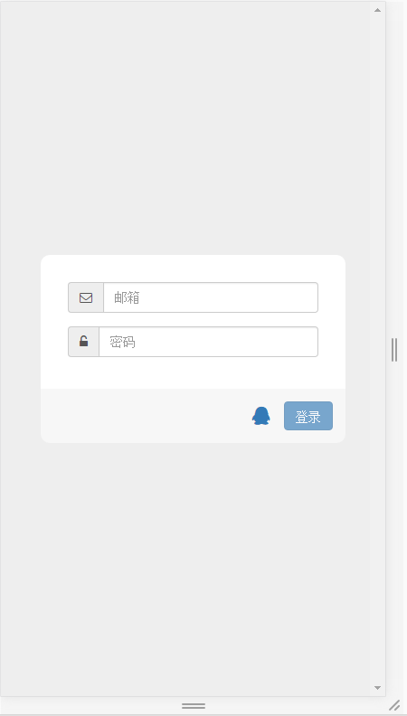
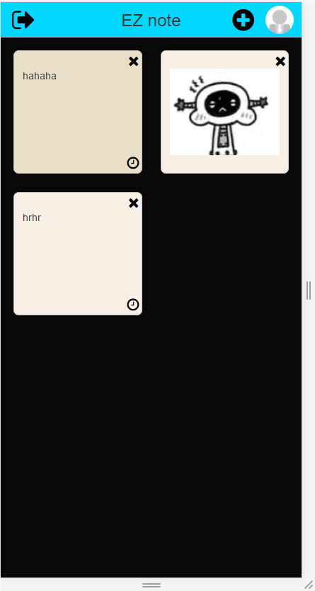
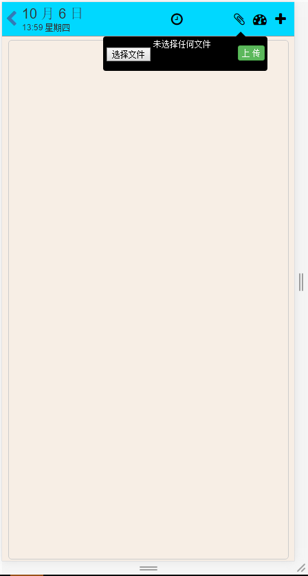
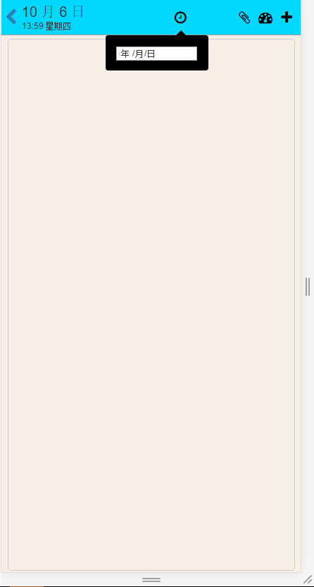
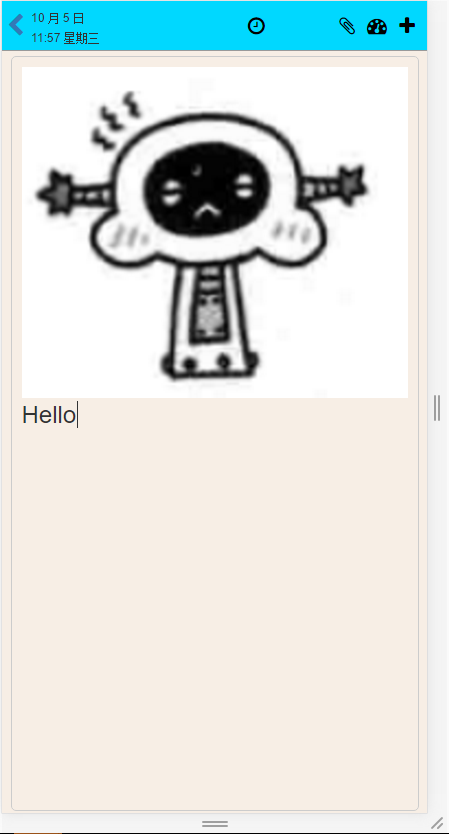

# HJL-Notepad 前端部分

## 简介
这是HJL-Notepad应用的前端部分，基于HTML5的contenteditable实现富文本编辑器，使用Vue+VueRouter+Vuex+VueResource进行开发，使用ES6语法进行代码编写，使用webpack+gulp搭建脚手架，使用Less预编译css。

## 基本功能
用户可以通过第三方账户登录应用，然后可以新建笔记，修改笔记，删除笔记等等，在新建或修改笔记时，可以添加笔记背景样式，添加提醒时间，或者添加图片记录等等

## 灵感
小米手机的记事本功能

##使用

```
$ git clone https://github.com/HUJINLIANG/HJL-Notepad-FE.git
$ cd HJL-Notepad-FE
$ npm install
```


## dev
```
gulp serve
```
在浏览中打开http://localhost:3000

## prod
 
```
$ npm start
```

## 布署

使用pm2进行部署

## ScreenShots








项目demo：[HJL-Note](http://note.hjlclould.cn/)

## 未完成项

没有实现真正的到时提醒功能，之后可以添加短信通知或者邮件通知等方式的到时提醒
